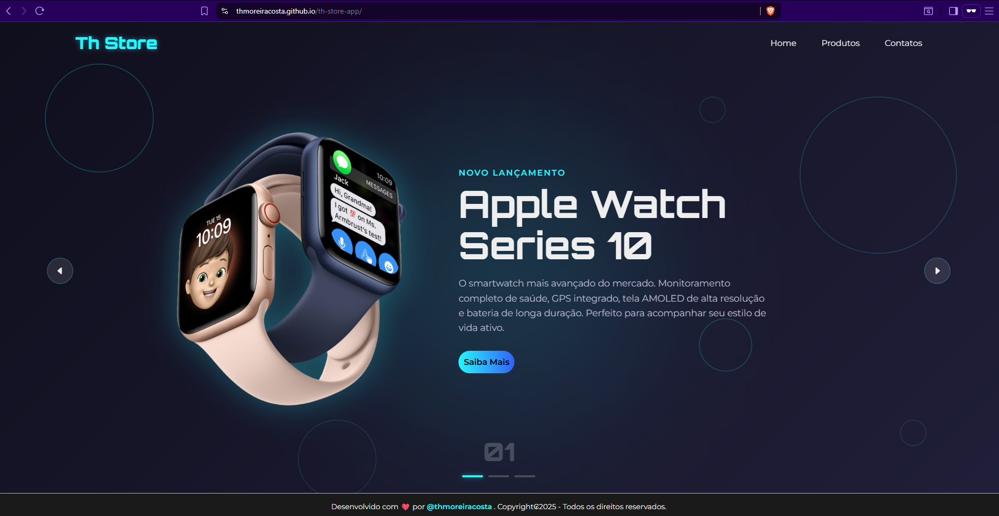

# ⌚ Th Store App

Bem-vindo ao **Th Store App**, uma aplicação web moderna para apresentação e venda de produtos tecnológicos.  
O projeto foi desenvolvido com foco em **design futurista, performance e usabilidade**, oferecendo uma experiência imersiva para os usuários.

---

## 🚀 Demonstração



---

## 📌 Funcionalidades

- 🖥️ **Landing Page Responsiva** – Interface adaptada para desktop, tablet e mobile  
- ⌚ **Exibição de Produtos em Destaque** – Apple Watch Series 10 como produto principal  
- 🎨 **Design Moderno** – Estilo futurista com animações e efeitos visuais  
- 🔍 **Navegação Intuitiva** – Menu superior com acesso rápido a **Home**, **Produtos** e **Contatos**  
- 🛒 **Chamada para Ação (CTA)** – Botão *Saiba Mais* para explorar detalhes  

---

## 🛠️ Tecnologias Utilizadas

- **HTML5**  
- **CSS3 / Tailwind CSS** (ou outro framework se aplicável)  
- **JavaScript (ES6+)**  
- [Framework/Lib caso usado, ex: React.js, Next.js ou Vue.js]  

---

## 📂 Estrutura do Projeto

```bash
th-store-app/
│── public/          # Arquivos públicos (imagens, ícones, etc.)
│── src/             # Código-fonte principal
│   ├── components/  # Componentes reutilizáveis
│   ├── pages/       # Páginas da aplicação
│   ├── styles/      # Estilos globais
│   └── assets/      # Imagens e mídias
│── package.json     # Dependências do projeto
│── README.md        # Documentação


## ⚙️ Como Executar o Projeto

- Clone o repositório:
  git clone https://github.com/thmoreiracosta/th-store-app.git

## 👨‍💻 Desenvolvido por Thiago Costa
<<<<<<< HEAD
- 🔗 GitHub @thmoreiracosta
=======
- 🔗 GitHub @thmoreiracosta
>>>>>>> 25fb6c40885144b270efcd6ac3e6bb5274c96b18
